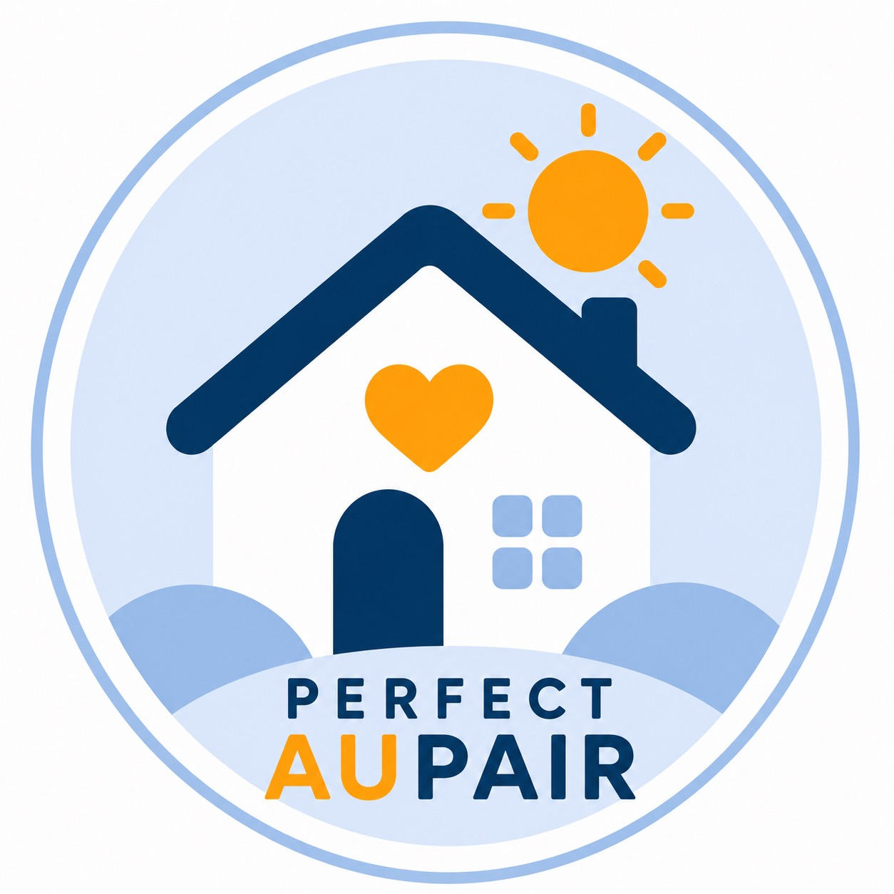
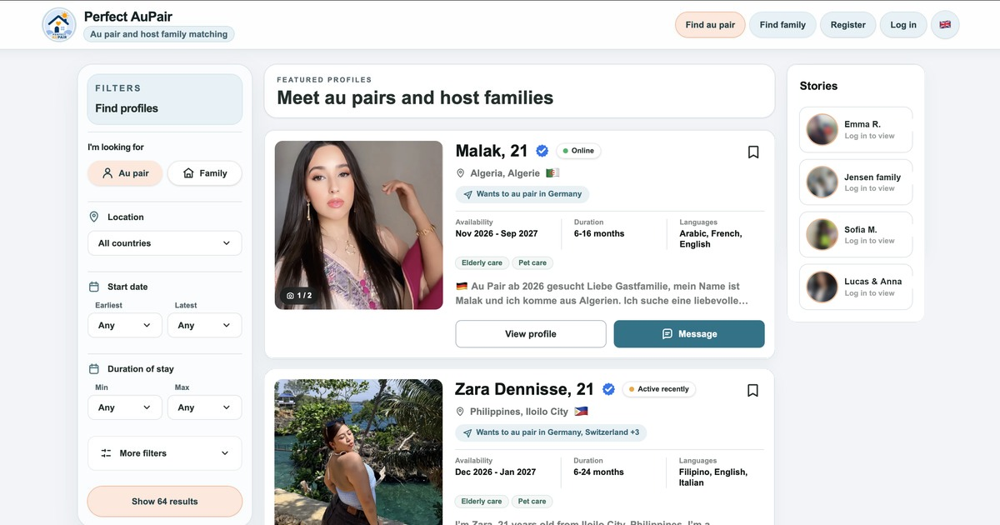

<div align="center">
  
  <h1>Perfect AuPair</h1>
  <p>A modern, privacy-conscious matching platform for au pairs and host families.</p>

</div>

## Product previews

<table>
  <tr>
    <th>Desktop experience</th>
    <th>Mobile experience</th>
  </tr>
  <tr>
    <td></td>
    <td></td>
  </tr>
</table>

Perfect AuPair was built from scratch to connect au pairs and host families through public discovery, structured profiles, private messaging, stories, saved profiles, identity verification, moderation, and multilingual editorial content. It was designed for the United States, Germany, the United Kingdom, Sweden, and Denmark.

## Product highlights

- Public profile discovery with server-side filtering, pagination, canonical profile URLs, and privacy-safe data projections
- Guided onboarding for both au pairs and host families
- Private realtime conversations with photos, video, and voice messages
- Stories, favourites, profile views, and in-app notifications
- Profile photo and optional introduction-video workflows
- Identity verification, reporting, blocking, suspension, and admin moderation tools
- English, German, Spanish, French, Dutch, and Italian interfaces
- Responsive layouts tested across modern desktop and mobile browser baselines
- Consent-gated analytics and privacy-aware telemetry

## Technology

- Next.js App Router, React, TypeScript, and Tailwind CSS
- Supabase Auth, Postgres, Storage, Realtime, RLS, and controlled RPCs
- Playwright end-to-end and browser-compatibility tests
- Vercel deployment with Cloudflare DNS
- GitHub Actions quality, dependency, CodeQL, and secret-scanning workflows

## Local development

Requirements: Node.js, pnpm, Docker, and the Supabase CLI.

```bash
pnpm install
cp .env.example .env.local
supabase start
pnpm dev
```

The local Supabase stack normally runs at `http://127.0.0.1:54321`. Environment examples contain placeholders only; never commit a populated `.env` file.

## Verification

```bash
pnpm verify
pnpm build
pnpm exec playwright test tests/e2e/smoke.spec.ts
```

Database-heavy changes can be verified from a clean local schema with `pnpm verify:db`.

## Security and privacy

The public application surface is intentionally separated from private profile and messaging data. Public discovery uses bounded server-side functions, while private media is delivered through same-origin authorization proxies. Row Level Security remains the baseline for database access.

Please do not report vulnerabilities in a public issue. See [SECURITY.md](SECURITY.md) for the responsible disclosure process.

## Project status

Perfect AuPair was an independently built product. The live service has been shut down and the project is no longer under active development. This repository remains public as a portfolio project and technical reference.

## Copyright

Copyright © 2026 Perfect AuPair. All rights reserved. No licence is granted to copy, modify, distribute, or deploy this source code unless the copyright owner provides written permission.
